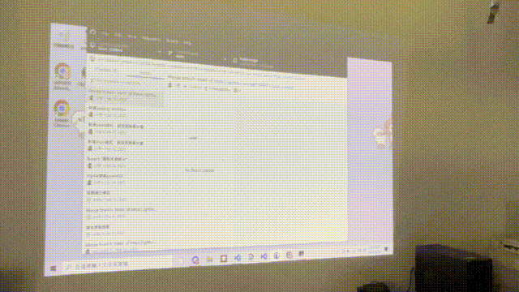

# Lazer Control

カメラでレーザーポインターの光点を追跡し、マウスカーソル操作にマッピングすることで、レーザーポインターによるPC操作を実現するツールです。

## デモ



## 機能

- カメラによるレーザーポインター光点のリアルタイム検出
- スクリーン四隅の自動認識と座標の透視変換
- シングルクリック・ダブルクリック・ドラッグなどのマウス操作に対応（レーザーの素早い点滅で発動）
- レーザーポインターのHSVカラー範囲を自動検出
- 背景差分法によるノイズ除去
- PyQt5によるモード切替UI

## 動作環境

- Windows
- Python >= 3.10

## インストール

```bash
uv sync
```

## 使い方

### 1. レーザーポインターの色キャリブレーション

初回使用時やレーザーポインターを変更した場合、まず色キャリブレーションを実行します。HSV範囲が自動検出され `point_hsv.json` に保存されます：

```bash
python get_point_hsv.py
```

- `Ctrl+F1`：スクリーン四隅を自動検出
- `Ctrl+F2`：収集済みの色データをクリア
- `Esc`：終了して結果を保存

### 2. レーザーポインター制御の起動

```bash
python main.py
```

- `Ctrl+F1`：スクリーン四隅を自動検出
- `Esc`：終了

### 操作ジェスチャー

ノートPCのタッチパッドと同じ操作感覚です。

| ジェスチャー     | トリガー方法                                                      |
| ---------------- | ----------------------------------------------------------------- |
| カーソル移動     | レーザーをスクリーンに照射                                        |
| シングルクリック | 目標位置に移動後、素早くレーザーを離す→押す→離す                  |
| ダブルクリック   | 目標位置に移動後、素早くレーザーを離す→押す→離すを2回繰り返す     |
| ドラッグ         | 目標位置に移動後、素早くレーザーを離す→押す→離す→押して押し続ける |

### デバッグツール

`debug_tool/` ディレクトリに各種補助ツールがあります：

- `parameter_control.py`：HSV・二値化パラメータをリアルタイム調整するGUI
- `auto_get_color/`：レーザー色自動取得の実験バージョン
- `brightness_control.py`：輝度しきい値の調整
- `canny_control.py`：Cannyエッジ検出パラメータの調整
- `get_corners.py`：四隅検出テスト

## 技術構成

- **画像処理**：OpenCV（HSVフィルタリング + 輝度二値化 + 背景差分）
- **座標変換**：透視投影の逆変換により、カメラ画面座標をスクリーン座標にマッピング
- **マウス制御**：pywin32（`win32api`）
- **UI**：PyQt5
- **ホットキー**：keyboard
